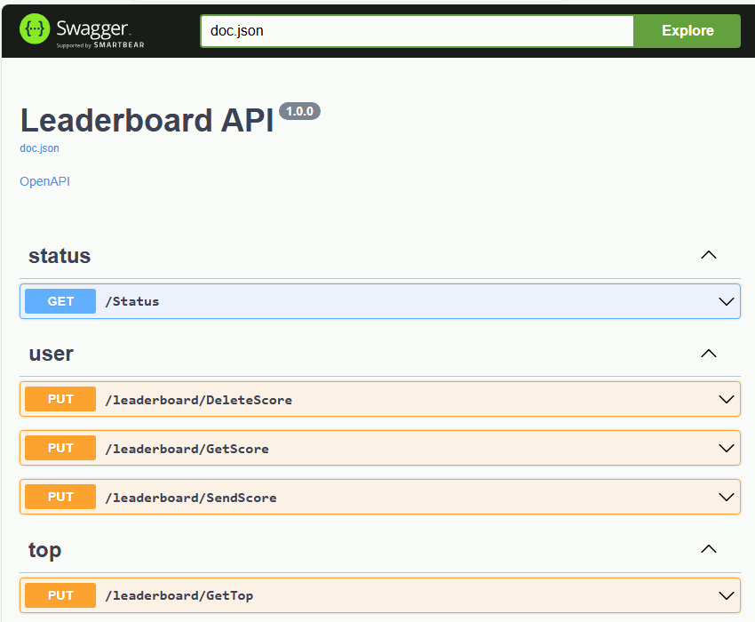

# Leaderboard server (Go)

## Introduction

This is a demo Go project that implements server logic of the game leaderboard. Key features are:
* Flexible modular structure.
* Validation of request parameters.
* Automatic generation of documentation based on the full OpenAPI specification and the ability to display it through Swagger UI.
* Support for multiple relational and non-relational databases: Redis, MongoDB, DynamoDB, PostgreSQL, MySQL and others.
* Testing database functionality (unit tests) through docker containers.

Please keep in mind that for a full launch in production this project lacks some important features, such as a request authorization mechanism.

## Prerequisites

* [Go](https://go.dev) 1.22
* [Docker](https://www.docker.com) (to run tests and to build and run containers)
* The Make utility (to run make commands)

## Configuring

You can set the necessary settings in the configuration files [internal/config/](internal/config/)

## Make commands

* `make deps` - install dependencies
* `make lint` - check the code with a linter (golangci-lint)
* `make test` - run tests

> **NOTE**
> Please keep in mind that running the tests for the first time may take a long time due to downloading the necessary docker images

* `make swag` - generate swagger specification based on code

> **NOTE**
> This will update docs.go, swagger.json, swagger.yaml files in the docs/ folder. You only need to do this when the API changes

* `make build_debug` - build the project (debug)
* `make run_debug` - run the project (debug)
* `make build` - build the project (production)
* `make run` - run the project (production)

More details on the list of Make commands can be found in the [Makefile](Makefile)

## API specification

By default, you can access Swagger UI at http://localhost:8415/ui/index.html after starting the local server (debug config).

	

## DB Providers

Any available DB provider can be used depending on your needs.

* **In-memory**. Simplest storage in RAM (per process). Only for testing purpose.

* **Redis**. An open-source in-memory storage.

* **DynamoDB**. A fully managed proprietary NoSQL database offered by Amazon.com as part of the Amazon Web Services. To create the necessary tables and indexes, use [dynamodb_setup.json](internal/db/dynamodb/dynamodb_setup.json)

* **MongoDB**. A document-oriented NoSQL database product. To create the necessary collections and indexes, use script [mongodb_setup.js](internal/db/mongodb/mongodb_setup.js)

* **PostgreSQL**. A free and open-source relational database management system. To create the necessary tables and indexes, use script [postgresql_setup.sql](internal/db/postgresql/postgresql_setup.sql)

* **MySQL**. An open-source relational database management system. To create the necessary tables and indexes, use script [mysql_setup.sql](internal/db/mysql/mysql_setup.sql)

## Keywords
leaderboard, golang, gin, openapi, swagger, swagger ui, swaggo, make, docker, redis, dynamodb, mongodb, postgresql, mysql